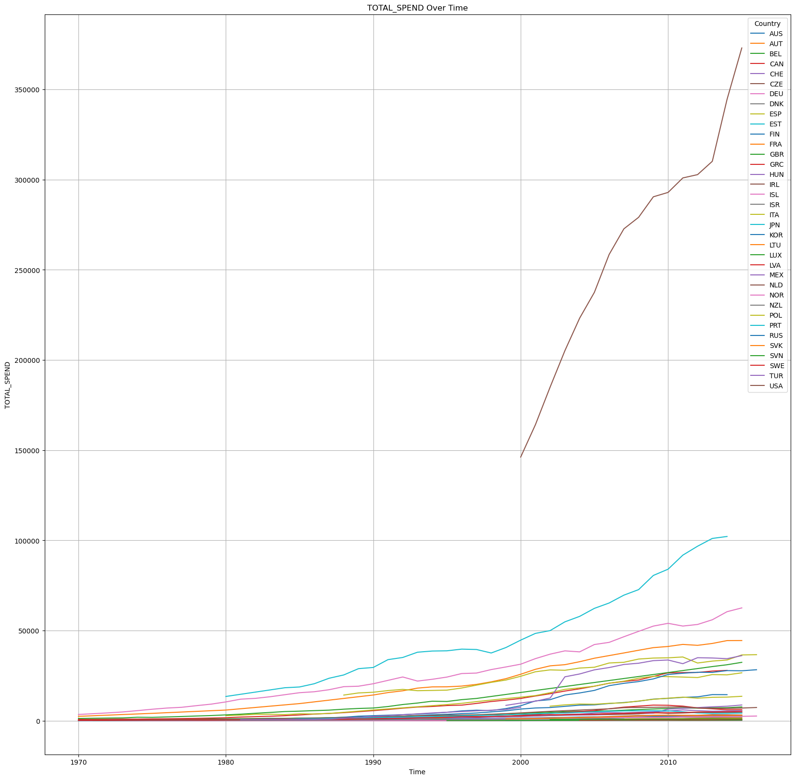

# Pharmaceutical Drug Spending by Countries
Data Science Institute - Cohort 4 - Team 22 Project

## Members
* Adrienne Lloren
* Anna Karlova
* Danica Leung
* Ferial Vahmiyan
* Nusrat Khan

# PART 1:

## Business Case

Our team has selected the Pharmaceutical Drug Spending by Countries dataset and will be investigating "Cost Optimization." By identifying high and low spenders, countries can adopt best practices to optimize their pharmaceutical spending. 

* https://datahub.io/core/pharmaceutical-drug-spending
* https://github.com/datasets/pharmaceutical-drug-spending

## Team Work Agreement

* We all agreed that we will independently work on all parts of the project and then during the 2nd team project week, we will compare, contrast and compile our findings into our Main branch.
* We will meet up on at 1pm during our next few Friday work periods and allocate 30 mins to an hour discussing our team project.
* In the meantime, we will each create our own branches to the dsi_team_22 repo where we will commit and push the research, code and analysis we independently work on.
* The focus for the upcoming weeks will be on data cleaning (How to decide what to do with missing data) as well as categorizing the dataset by the Top 10 and Bottom 10 spenders based on the countries' Average Health Expenditure per Capita. Explore these categories and document your findings and analysis.
* As we progress with the next few modules, we will revisit our tasks and deliverables for our team project.

## Initial Exploratory Data Analysis

To start we explored line plot visualizations of the features in the dataset. Below are the data visualizations produced during this EDA.

# PART 2:

OVERVIEW:

* Introduction
* Understanding the Raw Data
* Data Cleaning & Missing Values
* Identifying Top 10 & Bottom Spenders
* Trend Analysis - Top 10 Highest Spending Countries
* Trend Analysis - Bottom 10 Lowest Spending Countries
* Conclusion

## Introduction

## Understanding the Raw Data

### Schema 

| name | type | description |
|---|---|---|
| LOCATION | string (object) | Country code |
| TIME | number (int64) | Date in the form of %Y |
| PC_HEALTHXP | number (float64) | Percentage of health spending |
| PC_GDP | number (float64) | Percentage of GDP |
| USD_CAP | number (float64) | in USD per capita (using economy-wide PPPs) |
| FLAG_CODES | string (object) | Flag codes |
| TOTAL_SPEND | number (float64) | Total spending in millions |

### Understanding the Features

| column name | feature | description |
|------|-------|-------------|
| PC_HEALTHXP | Percentage of Health Expenditure | This is the percentage of a country's total health expenditure specifically spent on pharmaceuticals, including prescription medicines and over-the-counter products. |
| PC_GDP | Percentage of GDP | This is the percentage of the country's Gross Domestic Product (GDP) that is spent on pharmaceuticals. |
| USD_CAP | Health Expenditure per Capita in USD | This is the average amount of money spent on pharmaceuticals per person, calculated in US dollars. |
| TOTAL_SPEND | Total Spending | This is the total amount of money spent on pharmaceuticals by the country in a given year, typically in millions or billions of dollars. |
 
### Summarizations found in the dataset.

The following table presents key summarizations derived from the Pharmaceutical Drug Spending by Countries dataset. These summarizations provide a foundational understanding of the dataset's scope, including the number of countries, the time span covered, and the completeness of the data.

| question | analysis |
|----------|----------|
| How many countries are in this data set? | There are 36 countries in this data set. |
| How many years are in this data set? | There are 47 years in this data set. |
| What is the year range of this data set? | The data ranges from the years 1970 to 2016. |
| What is the total number of observations in the dataset? | There are 1036 observations in this data set |
| What is the total number of possible observations? | There are 1,692 possible observations |
| How many values are missing? | There are 656 missing values |

## Data Cleaning & Handling Missing Values

Through preprocessing we are able to identify missing values and outliers. To assist in visualizing the missing values in our dataset we created a heatmap, where blue indicated available data and yellow indicated missing data.

### Our Considerations: 

* Impact on Analysis:
    * More years generally provide a better trend analysis but come with the trade-off of more missing data.
    * Fewer years provide more complete data but may not capture long-term trends and changes effectively.

* Number of Countries:
    * Dropping fewer countries is preferable to maintain a larger sample size for more robust comparative analysis.
    * However, if the number of dropped countries does not significantly impact the representation, it may be acceptable to drop them for a more complete dataset.

* Business Case:
    * The focus on "Cost Optimization" requires reliable data to identify high and low spenders accurately.
    * Data completeness is critical to avoid biased conclusions and ensure accurate identification of best practices.

Based on this heatmap visualization and our aggregation considerations, our group decided to aggregate the dataset to the year range 2005 to 2014 and drop 4 countries (New Zealand, Russia, Turkey, and United Kingdom). 

| Start Date | End Date | # of Years | # Dropped Countries | List of Dropped Countries |
|:----:|:----:|:---:|:---:|:---|
| 2005 | 2014 | 10 | 4 | New Zealand, Russia, Turkey, United Kingdom |

### Correlation between Features

To explore the relationships between different variables we created a heatmap to visualize the correlation between each feature where a correlation closer to 1.00 means more correlated.

The following table shows the correlations between features.

| feature 1 | feature 2 | correlation |
|:---------:|:---------:|:-----------:|
| USD_CAP | TIME | 0.84 |
| PC_HEALTHXP |  PC_GDP | 0.72 |
| PC_GDP | USD_CAP | 0.67 |
| PC_GDP | TIME | 0.61 |

Since the correlation between the Health Spending per Capita vs Time produced a high correlation compared to the other variables, our team focused our efforts on this correlation when exploring the Top 10 and Bottom 10 health expenditure per country. Additionally, working with the Health Expenditure per Capita standardized our data exploration to already incorporate the other factors such as population.

## Identifying Top 10 & Bottom Spenders (2005 - 2014)

### Top 10 Highest Spending Countries (Average Per Capita)

This table ranks the top 10 highest spending countries by their average spending per capita in USD between the 2005 and 2014 year range.

| Rank | Country Code | Country Name     | Average Spending Per Capita ($ USD) |
|:----:|:------------:|:----------------:|:-----------------------------------:|
| 1    | USA          | United States    | 937.895500                          |
| 2    | CAN          | Canada           | 720.361100                          |
| 3    | CHE          | Switzerland      | 700.745600                          |
| 4    | GRC          | Greece           | 655.150889                          |
| 5    | JPN          | Japan            | 646.764700                          |
| 6    | IRL          | Ireland          | 635.788600                          |
| 7    | DEU          | Germany          | 627.021300                          |
| 8    | FRA          | France           | 617.524100                          |
| 9    | BEL          | Belgium          | 595.256000                          |
| 10   | LUX          | Luxembourg       | 573.441300                          |

### Bottom 10 Lowest Spending Countries (Per Capita)

This table ranks the countries by their average spending per capita in USD, starting from the lowest between the 2005 and 2014 year range.

| Rank | Country Code | Country Name     | Average Spending Per Capita ($ USD) |
|:----:|:------------:|:----------------:|:-----------------------------------:|
| 1    | LVA          | Latvia           | 269.196400                          |
| 2    | EST          | Estonia          | 269.575900                          |
| 3    | ISR          | Israel           | 274.791375                          |
| 4    | MEX          | Mexico           | 277.979500                          |
| 5    | POL          | Poland           | 304.320700                          |
| 6    | DNK          | Denmark          | 324.135200                          |
| 7    | LTU          | Lithuania        | 373.809400                          |
| 8    | CZE          | Czech Republic   | 395.318600                          |
| 9    | NOR          | Norway           | 412.787900                          |
| 10   | NLD          | Netherlands      | 428.909700                          |

## Trend Analysis - Top 10 Highest Spending Countries

### Linear Regression

### Clustering

### Forecasting

## Trend Analysis - Bottom 10 Lowest Spending Countries

### Linear Regression

### Clustering

### Forecasting

## Conclusion
