# Pharmaceutical Drug Spending by Countries
Data Science Institute - Cohort 4 - Team 22 Project

## Members
* Adrienne Lloren ([amlloren](https://github.com/amlloren))
* Anna Karlova ([anna-karl](https://github.com/Anna-Karl))
* Danica Leung ([ldanica](https://github.com/ldanica))
* Ferial Vahmiyan ([ferialvahmiyan](https://github.com/Ferialvahmiyan))
* Nusrat Khan([nusikhan](https://github.com/NusiKhan))

## Business Case

Our team has selected the Pharmaceutical Drug Spending by Countries dataset. Our goal is to identify the Top 10 and Bottom 10 spending countries (ranked by the average of Health Spending per Capita) to gain insights on these two country groupings. To start, we explored the general characteristics of the raw data and came up with a strategy to handle missing values. We implemented an aggregation to the year range 2005 and 2014 to clean the data from missing values and outliers. Next, we grouped the Top 10 and Bottom 10 countries and explored them using Linear Regression, Clustering, Forecasting and Static and Dynamic Data Visualization using python. Optionally, we also explored data visualization using Tableau Public. 

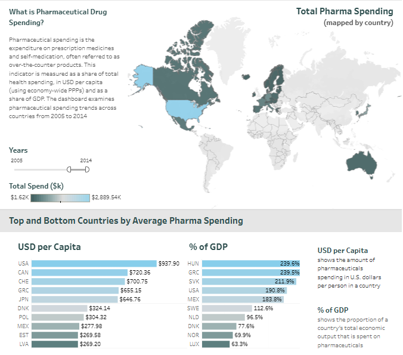

Screenshot of Pharmaceutical Drug Spending dashboard ([Tableau Public Link](https://public.tableau.com/app/profile/anna.karlova/viz/Pharmaspendingbycountries1970-2015/Dashboard1))

We sourced our raw dataset by downloading them from the links below:
* https://datahub.io/core/pharmaceutical-drug-spending
* https://github.com/datasets/pharmaceutical-drug-spending

## Project Overview

* [Requirements](#requirements)
* [Exploratory Data Analysis](#exploratory-data-analysis)
* [Understanding the Raw Data](#understanding-the-raw-data)
* [Data Cleaning and Handling Missing Values](#data-cleaning-and-handling-missing-values)
* [Identifying Top 10 and Bottom 10 Spenders](#identifying-top-10-and-bottom-10-spenders)
* [Data Analysis on Python](#data-analysis-on-python)
    * [Linear Regression](#data-analysis-on-python)
    * [Clustering](#clustering)
    * [Forecasting](#forecasting)
* [Data Visualization on Tableau](#data-visualization-on-tableau)
* [Conclusion](#conclusion)

### Requirements

This project uses the following Python libraries

* NumPy : For fast matrix operations.
* pandas : For analysing and getting insights from datasets.
* matplotlib : For creating graphs and plots.
* seaborn : For enhancing the style of matplotlib plots.
* sklearn : For linear regression analysis.
* ydata_profiling : For EDA
* pandas_visual_analysis : Visual Analysis
* plotly : For dynamic plots
* ipywidgets : For interactive plots
* dash : For working with html
* statsmodel.api : For processing statistic information

## Exploratory Data Analysis

To explore the dynamic features download the [1_EDA.ipynb](1_EDA.ipynb) file in our repo.

## Understanding the Raw Data

### Schema 

| name | type | description |
|---|---|---|
| LOCATION | string (object) | Country code |
| TIME | number (int64) | Date in the form of %Y |
| PC_HEALTHXP | number (float64) | Percentage of health spending |
| PC_GDP | number (float64) | Percentage of GDP |
| USD_CAP | number (float64) | in USD per capita (using economy-wide PPPs) |
| FLAG_CODES | string (object) | Flag codes |
| TOTAL_SPEND | number (float64) | Total spending in millions |

### Understanding the Features

| column name | feature | description |
|------|-------|-------------|
| PC_HEALTHXP | Percentage of Health Expenditure | This is the percentage of a country's total health expenditure specifically spent on pharmaceuticals, including prescription medicines and over-the-counter products. |
| PC_GDP | Percentage of GDP | This is the percentage of the country's Gross Domestic Product (GDP) that is spent on pharmaceuticals. |
| USD_CAP | Health Expenditure per Capita in USD | This is the average amount of money spent on pharmaceuticals per person, calculated in US dollars. |
| TOTAL_SPEND | Total Spending | This is the total amount of money spent on pharmaceuticals by the country in a given year, typically in millions or billions of dollars. |
 
### Summarizations found in the dataset.

The following table presents key summarizations derived from the Pharmaceutical Drug Spending by Countries dataset. These summarizations provide a foundational understanding of the dataset's scope, including the number of countries, the time span covered, and the completeness of the data.

| question | analysis |
|----------|----------|
| How many countries are in this data set? | There are 36 countries in this data set. |
| How many years are in this data set? | There are 47 years in this data set. |
| What is the year range of this data set? | The data ranges from the years 1970 to 2016. |
| What is the total number of observations in the dataset? | There are 1036 observations in this data set |
| What is the total number of possible observations? | There are 1,692 possible observations |
| How many values are missing? | There are 656 missing values |

The supporting python code can be viewed in the [2_summarizations.ipynb](2_summarizations.ipynb) file in our repo.

## Data Cleaning and Handling Missing Values

Through preprocessing we are able to identify missing values and outliers. To assist in visualizing the missing values in our dataset we created a heatmap, where blue indicated available data and yellow indicated missing data.

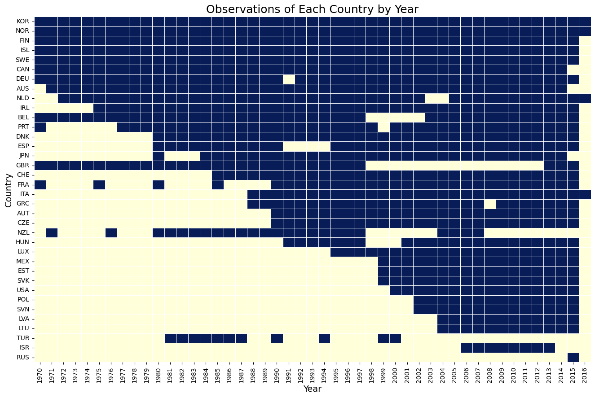

### Our Considerations: 

* Impact on Analysis:
    * More years generally provide a better trend analysis but come with the trade-off of more missing data.
    * Fewer years provide more complete data but may not capture long-term trends and changes effectively.

* Number of Countries:
    * Dropping fewer countries is preferable to maintain a larger sample size for more robust comparative analysis.
    * However, if the number of dropped countries does not significantly impact the representation, it may be acceptable to drop them for a more complete dataset.

* Business Case:
    * The focus on this project requires reliable data to identify high and low spenders accurately.
    * Data completeness is critical to avoid biased conclusions and ensure accurate identification of best practices.

Based on this heatmap visualization and our aggregation considerations, our group decided to aggregate the dataset to the year range 2005 to 2014 and drop 4 countries (New Zealand, Russia, Turkey, and United Kingdom). 

| Start Date | End Date | # of Years | # Dropped Countries | List of Dropped Countries |
|:----:|:----:|:---:|:---:|:---|
| 2005 | 2014 | 10 | 4 | New Zealand, Russia, Turkey, United Kingdom |

NOTE: For some but not all analyses Israel was dropped and/or the data for 2015 was used.

### Correlation between Features

To explore the relationships between different variables we created a heatmap to visualize the correlation between each feature where a correlation closer to 1.00 means more correlated.

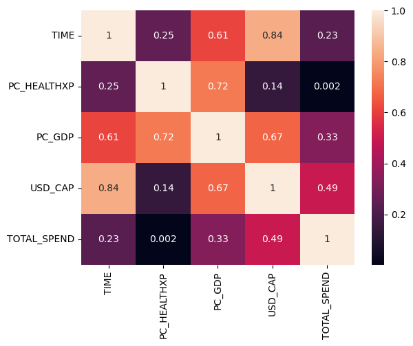

The following table shows the correlations between features.

| feature 1 | feature 2 | correlation |
|:---------:|:---------:|:-----------:|
| USD_CAP   | TIME      | 0.84        |
| PC_HEALTHXP |  PC_GDP | 0.72 |
| PC_GDP | USD_CAP | 0.67 |
| PC_GDP | TIME | 0.61 |

Since the correlation between the Health Spending per Capita vs Time produced a high correlation compared to the other variables, our team focused our efforts on this correlation when exploring the Top 10 and Bottom 10 health expenditure per country. Additionally, working with the Health Expenditure per Capita standardized our data exploration to already incorporate the other factors such as population.

The supporting python code can be viewed in the [3_data_cleaning.ipynb](3_data_cleaning.ipynb) file in our repo.

## Identifying Top 10 and Bottom 10 Spenders
The ranking is based off the average health spend per capita for the year range 2005 to 2014. Due to the time restrainst of this team project, we opted to focus on the Top 10 and Bottom 10 countries and ommitted exploring the countries that fell in the mid-level category. By doing so our analysis is not completely comprehensive but it allowed us to explore the polar ends of the dataset more thoroughly.

### Top 10 Highest Spending Countries (Average Per Capita)

This table ranks the top 10 highest spending countries by their average spending per capita in USD between the 2005 and 2014 year range.

| Rank | Country Code | Country Name     | Avg Spend Per Capita ($ USD) |
|:----:|:------------:|:----------------:|:-----------------------------------:|
| 1    | USA          | United States    | 937.895500                          |
| 2    | CAN          | Canada           | 720.361100                          |
| 3    | CHE          | Switzerland      | 700.745600                          |
| 4    | GRC          | Greece           | 655.150889                          |
| 5    | JPN          | Japan            | 646.764700                          |
| 6    | IRL          | Ireland          | 635.788600                          |
| 7    | DEU          | Germany          | 627.021300                          |
| 8    | FRA          | France           | 617.524100                          |
| 9    | BEL          | Belgium          | 595.256000                          |
| 10   | LUX          | Luxembourg       | 573.441300                          |

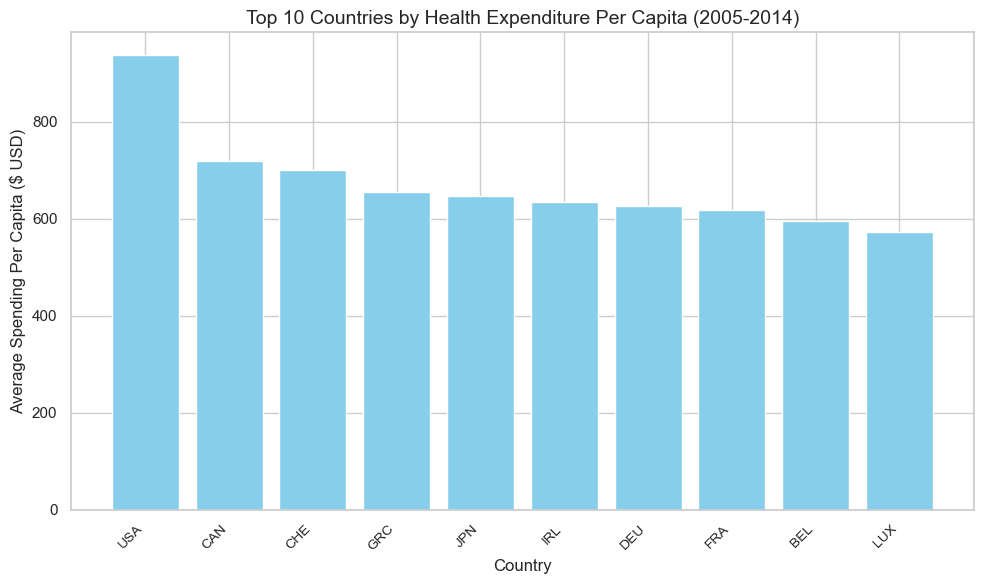

### Bottom 10 Lowest Spending Countries (Average Per Capita)

This table ranks the countries by their average spending per capita in USD, starting from the lowest between the 2005 and 2014 year range.

| Rank | Country Code | Country Name     | Avg Spend Per Capita ($ USD) |
|:----:|:------------:|:----------------:|:-----------------------------------:|
| 1    | LVA          | Latvia           | 269.196400                          |
| 2    | EST          | Estonia          | 269.575900                          |
| 3    | ISR          | Israel           | 274.791375                          |
| 4    | MEX          | Mexico           | 277.979500                          |
| 5    | POL          | Poland           | 304.320700                          |
| 6    | DNK          | Denmark          | 324.135200                          |
| 7    | LTU          | Lithuania        | 373.809400                          |
| 8    | CZE          | Czech Republic   | 395.318600                          |
| 9    | NOR          | Norway           | 412.787900                          |
| 10   | NLD          | Netherlands      | 428.909700                          |

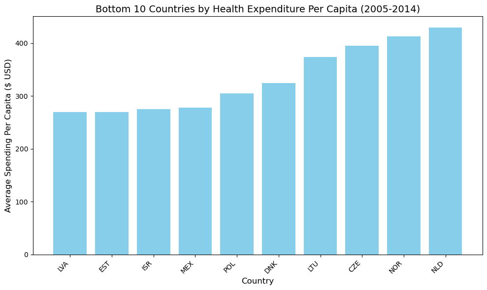

The supporting python code can be viewed in the [4_top_bottom.ipynb](4_top_bottom.ipynb) file in our repo.

# Data Analysis on Python
Now that we have grouped the Top 10 and Bottom 10 countries we are able to explore them using Linear Regression, Clustering, Forecasting as well as Static and Dynamic Data Visualization using python. Optionally, we also explored data visualization using Tableau Public. 

## Multiple Linear Regression

We chose to regress TOTAL_SPEND on variables USD_CAP, PC_HEALTHXP, and PC_GDP , to explore how these factors influence total spending. To understand the relationship between total spending and these independent variables, which we hypothesize might have an impact on the total amount spent by each country. Due to missing values only 2004-2015 was used and RUS,ISR,TUR,NZL and GBR were dropped. 
However, it's important we are using a timeseries data set and Linear Regression is not the best model for a timeseries analysis. This model is likely to suffer from autocorrelation, stationarity, and overfitting. Models such as ARMA or ARIMA would have been better suited, but we did not cover those in the course. If we had more time we could have explored other models. 

Since our dataset contains 2016 data for a few countries, we choose to forecast 2016 first and then compare the error to see the difference between the forecast and the actual. 

The errors are low enough so we can proceed to forecast 2016-2018.

The R-square being 1 suggests overfitting. The Durbin-Watson statistic also suggests autocorrelation. We predicted both of these problems would happen earlier due to using Linear Regression.However, the p-value of the F-statistic is really small which means the model is still significant. The coefficients for PC_HEALTHXP and USD_CAP are also significant, which means these have a strong relatoinship with our target variable.

To keep things simple, we only plot the forecast for top 10 countries using a 95% confidence interval.

All of the forecasted points fall within the 95% confidence interval, indicating that they are statistically significant at the 95% confidence level. Although our model suffers from some limitations, the outcome is still significant.

NOTE: Isreal was dropped because it was missing values for 2014, 2015 and 2016.

The supporting python code can be viewed in the [5_linear_regression.ipynb](5_linear_regression.ipynb) file in our repo.

## Linear Regression (Dynamic Plots)

We also developed an interactive method to explore the linear regression for each country which can be filtered by Location and Features. Below is a screenshot:

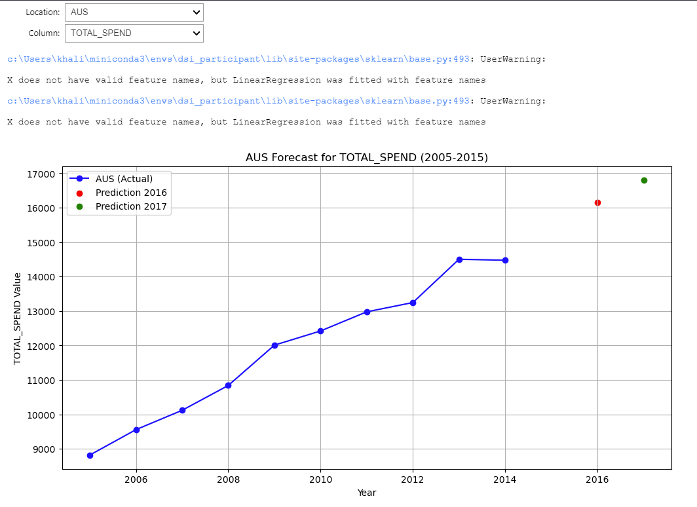

To explore the dynamic features download the [7_dynamic_plots.ipynb](7_dynamic_plots.ipynb) file in our repo.

## Clustering

The clustering analysis grouped the 20 selected countries (top 10 and bottom 10 spenders) into three distinct clusters:

| Cluster # | Category | Countries |
|:---------:|:--------:|:----------|
| 0 | Top | LUX, CAN, CHE, GRC, JPN, IRL, DEU, FRA, BEL |
| 1 | Bottom | CZE, LTU, DNK, POL, NLD, MEX, EST, LVA, NOR, ISR
| 2 | Outlier | USA |

* Cluster 0: Represents the top 10 spending countries (excluding the USA), confirming their high average pharmaceutical expenditure per capita.
* Cluster 1: Corresponds to the bottom 10 spending countries, highlighting their lower average pharmaceutical expenditure per capita.
* Cluster 2: Contains only the United States, an outlier due to its significantly higher spending per capita and total expenditure compared to other countries.

### Key Observations
* Outlier Identification: The USA, being in its own cluster, underscores its unique position as an extreme high-spender. This finding aligns with its distinct spending patterns observed during earlier analyses.
* Spending Patterns:
    * Cluster 0 countries (top spenders) exhibit high per-capita pharmaceutical expenditure but lower percentages of total healthcare spending allocated to pharmaceuticals.
    * Conversely, Cluster 1 countries (bottom spenders) show lower per-capita expenditures but allocate a higher proportion of their healthcare budgets to pharmaceuticals.

### Visual Insights

Cluster Graph: The clustering plot visually demonstrates the separation between the three clusters, with the USA distinctly positioned as an outlier.

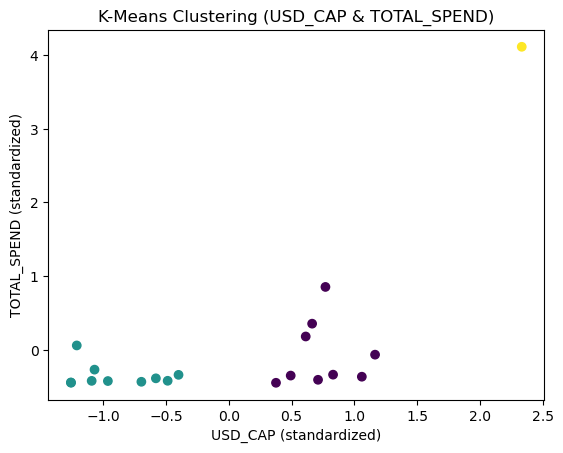

Average Features by Cluster: A bar plot comparing cluster-level averages reveals that countries in Cluster 0 and Cluster 2 spend substantially more per capita, while Cluster 1 countries allocate a larger share of their healthcare budgets to pharmaceuticals.

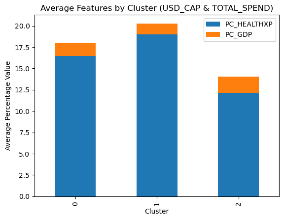

Implications
This clustering analysis highlights important nuances in spending behavior among countries. The USA’s outlier status suggests that factors beyond healthcare expenditure patterns, such as policy and market dynamics, drive its exceptionally high spending. In contrast, Cluster 0 and Cluster 1 differences indicate varied priorities, with some countries achieving higher efficiency by spending less while allocating a greater percentage to pharmaceuticals.

Future analyses could explore mid-level spenders and examine additional variables like population health outcomes to uncover further insights.

The supporting python code can be viewed in the [6_clustering.ipynb](6_clustering.ipynb) file in our repo.

## Dynamic Plots

Here are a few reasons why dynamic plotting is beneficial:

- Interactivity Enhances Insights: Dynamic plots allow users to zoom, pan, and hover over data points, making it easier to explore and uncover trends, patterns, or outliers that static plots might obscure.

- Customizable Views: Users can filter data, adjust parameters, or select specific subsets, enabling a more tailored analysis without regenerating the entire plot.

- Better Storytelling: Dynamic visualizations can adapt to different narratives or audiences, making them ideal for interactive dashboards or presentations where stakeholders can explore the data themselves.

- Real-Time Data Exploration: Dynamic plots are perfect for situations where datasets are updated in real-time or where rapid iterations of visualizations are needed to analyze evolving trends.

- Improved User Engagement: By involving the viewer in the analysis process, dynamic plots encourage engagement and deeper understanding compared to passive consumption of static visuals.

- Scalable for Large Datasets: With tools like Plotly and Dash, dynamic visualizations can handle large datasets efficiently, providing responsive and smooth interaction capabilities.

Dynamic plots turn static visuals into tools for exploration, making data analysis more interactive, flexible, and engaging.

To explore the dynamic features download the [7_dynamic_plots.ipynb](7_dynamic_plots.ipynb) file in our repo.

## Forecasting

The method of forecasting in the provided code uses Facebook Prophet, a powerful open-source forecasting tool designed for time series data. It is particularly effective when your data exhibits patterns like seasonality, trends, or irregular intervals.

#### Why Prophet for This Task?

* Automatic Seasonality Detection: Prophet automatically identifies yearly or weekly cycles in the data, which is useful when you have data like spending trends.
* Handles Missing Data: Prophet can deal with missing or irregular data, which is common in real-world datasets.
* Confidence Intervals: It provides predictions with uncertainty bounds (e.g., upper and lower confidence intervals), helping to assess the reliability of forecasts.
* Ease of Use: Minimal configuration is required, making it accessible for quick forecasting.

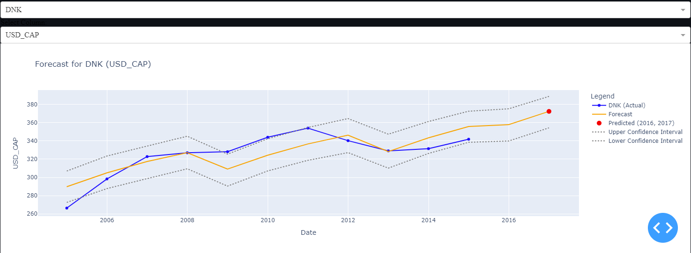

NOTE: This is a dynamic plot and requires being opened. To explore the dynamic features download the [7_dynamic_plots.ipynb](7_dynamic_plots.ipynb) file in our repo.

## Data Visualization on Tableau

* Global Health Spend ([Tableau Public Link](https://public.tableau.com/app/profile/anna.karlova/viz/Pharmaspendingbycountries1970-2015/Dashboard1))
* Top 10 Countries Dashboard ([Tableau Public Link](https://public.tableau.com/app/profile/adrienne.lloren/viz/PharmaceuticalDrugSpendingbyCountries_17333346970600/TOP10))
* Bottom 10 Countries Dashboard ([Tableau Public Link](https://public.tableau.com/app/profile/adrienne.lloren/viz/PharmaceuticalDrugSpendingbyCountries_17333346970600/BOTTOM10))

## Conclusion
The analysis revealed significant disparities between the top 10 and bottom 10 countries in pharmaceutical spending per capita. Leveraging insights from correlations and trends, the study highlighted the importance of accurate and complete data for effective decision-making. While the project explored key patterns and developed robust visual and statistical models, time constraints limited the scope to a focused subset of the dataset. Future efforts could include deeper analysis into mid-tier countries, adoption of advanced forecasting models, and exploration of causative factors beyond expenditures, such as population health outcomes. This project underscores the potential of data science in driving informed policy decisions and optimizing healthcare expenditures worldwide.

## Team Videos:
* Adrienne Lloren
* Anna Karlova
* Danica Leung
* Ferial Vahmiyan https://drive.google.com/file/d/1V78-48VG6IC-yds4NT3BeSyb4-w71ESh/view?usp=sharing
* Nusrat Khan

# PART 1:

## Business Case

Our team has selected the Pharmaceutical Drug Spending by Countries dataset and will be investigating "Cost Optimization." By identifying high and low spenders, countries can adopt best practices to optimize their pharmaceutical spending. 

* https://datahub.io/core/pharmaceutical-drug-spending
* https://github.com/datasets/pharmaceutical-drug-spending

## Team Work Agreement

* We all agreed that we will independently work on all parts of the project and then during the 2nd team project week, we will compare, contrast and compile our findings into our Main branch.
* We will meet up on at 1pm during our next few Friday work periods and allocate 30 mins to an hour discussing our team project.
* In the meantime, we will each create our own branches to the dsi_team_22 repo where we will commit and push the research, code and analysis we independently work on.
* The focus for the upcoming weeks will be on data cleaning (How to decide what to do with missing data) as well as categorizing the dataset by the Top 10 and Bottom 10 spenders based on the countries' Average Health Expenditure per Capita. Explore these categories and document your findings and analysis.
* As we progress with the next few modules, we will revisit our tasks and deliverables for our team project.

## Initial Exploratory Data Analysis

To start we explored line plot visualizations of the features in the dataset. Below are the data visualizations produced during this EDA.

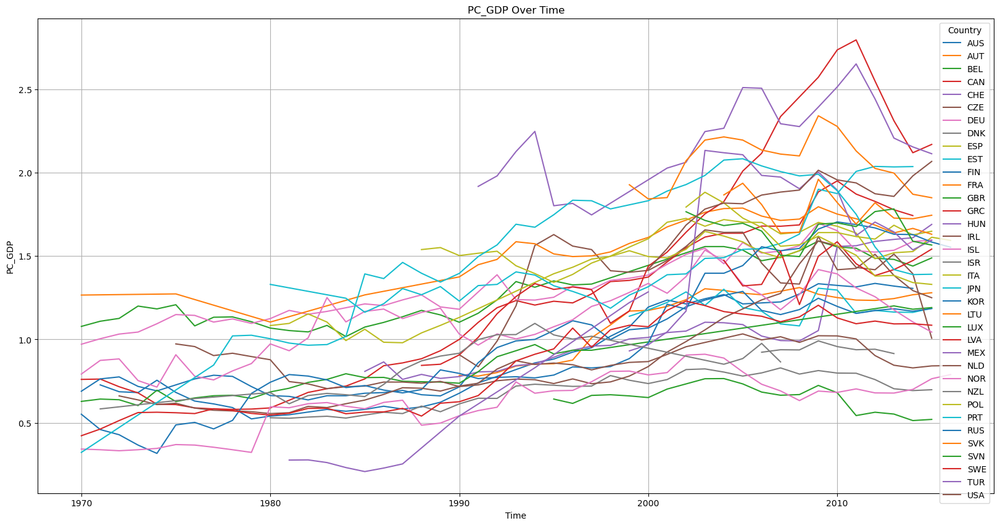
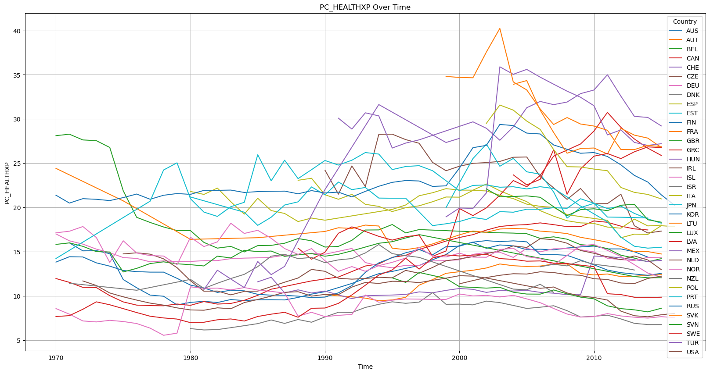
